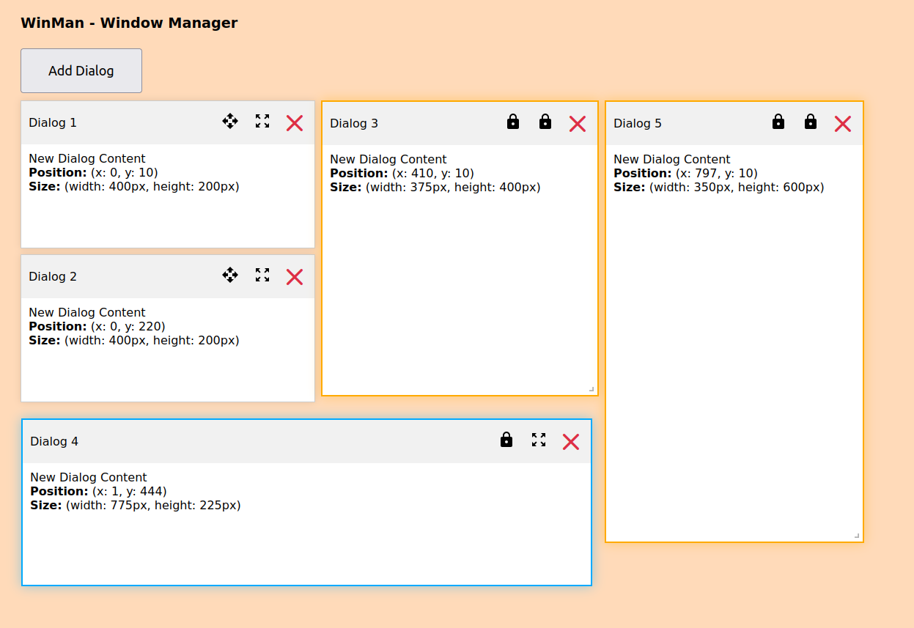

# WinMan - Window Manager for React


## Table of Contents

1. [Introduction](#introduction)
2. [Installation](#installation)
3. [Usage](#usage)
   - [Dialog](#dialog)
   - [DialogManager](#dialogmanager)
   - [DialogContext](#dialogcontext)

## Introduction

This project provides a flexible and customizable dialog system for React applications.
It includes components for creating, managing, and displaying dialogs.

**Screenshot**



## Installation

1. Clone the repository:

   ```sh
   git clone https://github.com/Digitanalogik/react-window-manager
   cd react-window-manager
   ```

2. Install the dependencies:
   ```sh
   yarn install
   ```

## Usage

### Dialog

The `Dialog` component is used to create individual dialog windows.
It supports dragging and resizing.

1. **Create the Component to be Injected:** First, create the React component that you want to inject into the `Dialog` component. For example, let's create a simple `ContentComponent`.

```typescript
// ContentComponent.tsx
import React from "react";

const ContentComponent = () => (
  <div>
    <h2>Dialog Content</h2>
    <p>This is the content of the dialog.</p>
  </div>
);

export default ContentComponent;
```

2. **Import the Component and Dialog:** Import the `ContentComponent` and the `Dialog` component into the file where you want to use them.

```typescript
// App.tsx or any other file
import React from "react";
import Dialog from "./components/Dialog";
import ContentComponent from "./components/ContentComponent";
```

3. **Inject the Component into the Dialog:** Pass the `ContentComponent` as a prop to the `Dialog` component. You can use the `component` prop to inject the component.

```typescript
const App = () => {
  return (
    <div>
      <Dialog
        id={1}
        title="My Dialog"
        position={{ x: 100, y: 100 }}
        visible={true}
        onClose={() => console.log("Dialog closed")}
        onResize={(id, size) => console.log("Dialog resized", id, size)}
        component={<ContentComponent />} // Injecting the component
      />
    </div>
  );
};

export default App;
```

### DialogManager

The `DialogManager` component is responsible for managing multiple dialogs.
It uses the `DialogContext` to keep track of the dialogs' state.

**Example**

```typescript
import React from "react";
import { DialogManager } from "./components/DialogManager";

const App = () => {
  return (
    <DialogProvider>
      <div id="app">
        <h1>WinMan - Window Manager</h1>
        <DialogManager />
        {/* Your application components */}
      </div>
    </DialogProvider>
  );
};

export default App;
```

### DialogContext

The `DialogContext` in this code provides a context for managing dialogs within a React application. It includes interfaces and functions that help in creating, managing, and interacting with dialog components. Here’s a detailed explanation:

#### Interfaces

1. `DialogData`: This interface defines the structure of a dialog object. It includes:

- `id`: A unique identifier for the dialog.
- `title`: The title of the dialog.
- `position`: An object containing the x and y coordinates of the dialog.
- `size`: An object containing the width and height of the dialog.
- `visible`: A boolean indicating whether the dialog is visible.
- `component`: The React component to be rendered inside the dialog.

```typescript
interface DialogData {
  id: number;
  title: string;
  position: { x: number; y: number };
  size: { width: number; height: number };
  visible: boolean;
  component: JSX.Element;
}
```

2. `DialogContextType`: This interface defines the structure of the context value. It includes:

- `dialogs`: An array of `DialogData` objects representing the current dialogs.
- `addDialog`: A function to add a new dialog. It takes a title and a component as arguments.
- `closeDialog`: A function to close a dialog. It takes the id of the dialog to be closed.
- `resizeDialog`: A function to resize a dialog. It takes the id of the dialog and a size object containing the new width and height.

```typescript
interface DialogContextType {
  dialogs: DialogData[];
  addDialog: (title: string, component: JSX.Element) => void;
  closeDialog: (id: number) => void;
  resizeDialog: (id: number, size: { width: number; height: number }) => void;
}
```

#### Context and Hook

1. `DialogContext`: This is the context object created using `createContext`. It holds the value of type `DialogContextType` or `undefined`.

```typescript
const DialogContext = createContext<DialogContextType | undefined>(undefined);
```

2. `useDialogContext`: This is a custom hook that provides access to the `DialogContext`. It ensures that the hook is used within a `DialogProvider`.

```typescript
export const useDialogContext = (): DialogContextType => {
  const context = useContext(DialogContext);
  if (!context) {
    throw new Error("useDialogContext must be used within a DialogProvider");
  }
  return context;
};
```

#### Provider Component

1. `DialogProvider`: This is a React functional component that provides the `DialogContext` to its children. It manages the state of the dialogs and provides functions to add, close, and resize dialogs.

```typescript
export const DialogProvider: React.FC<{ children: ReactNode }> = ({
  children,
}) => {
  const [dialogs, setDialogs] = useState<DialogData[]>([]);

  const addDialog = (title: string, component: JSX.Element) => {
    const lastDialog = dialogs[dialogs.length - 1];
    const defaultPosition = lastDialog
      ? {
          x: lastDialog.position.x,
          y: lastDialog.position.y + lastDialog.size.height + GAP,
        }
      : { x: DEFAULT_X, y: DEFAULT_Y };

    const newDialog: DialogData = {
      id: Date.now(),
      position: defaultPosition,
      title,
      component,
      visible: true,
      size: { width: DEFAULT_DIALOG_WIDTH, height: DEFAULT_DIALOG_HEIGHT },
    };

    setDialogs([...dialogs, newDialog]);
  };

  const closeDialog = (id: number) => {
    setDialogs((prevDialogs) =>
      prevDialogs.map((dialog) =>
        dialog.id === id ? { ...dialog, visible: false } : dialog
      )
    );
  };

  const resizeDialog = (
    id: number,
    size: { width: number; height: number }
  ) => {
    setDialogs((prevDialogs) =>
      prevDialogs.map((dialog) =>
        dialog.id === id ? { ...dialog, size } : dialog
      )
    );
  };

  return (
    <DialogContext.Provider
      value={{ dialogs, addDialog, closeDialog, resizeDialog }}
    >
      {children}
    </DialogContext.Provider>
  );
};
```

#### Summary

- `DialogData`: Defines the structure of a dialog object.
- `DialogContextType`: Defines the structure of the context value, including functions to manage dialogs.
- `DialogContext`: The context object that holds the dialog state and functions.
- `useDialogContext`: A custom hook to access the DialogContext.
- `DialogProvider`: A provider component that manages the state of dialogs and provides context to its children.

By using these interfaces and functions, developers can easily manage dialogs within their React applications, ensuring a consistent and flexible dialog system.

## External Libraries

### react-draggable

[react-draggable](https://github.com/react-grid-layout/react-draggable) is used to make the dialogs draggable. This allows users to click and drag the dialogs to reposition them within the application window.

### react-resizable

[react-resizable](https://github.com/react-grid-layout/react-resizable) is used to make the dialogs resizable. This allows users to click and drag the edges or corners of the dialogs to resize them as needed.

```
~Tatu Soininen~
  -=[ 2024 ]=-
```
